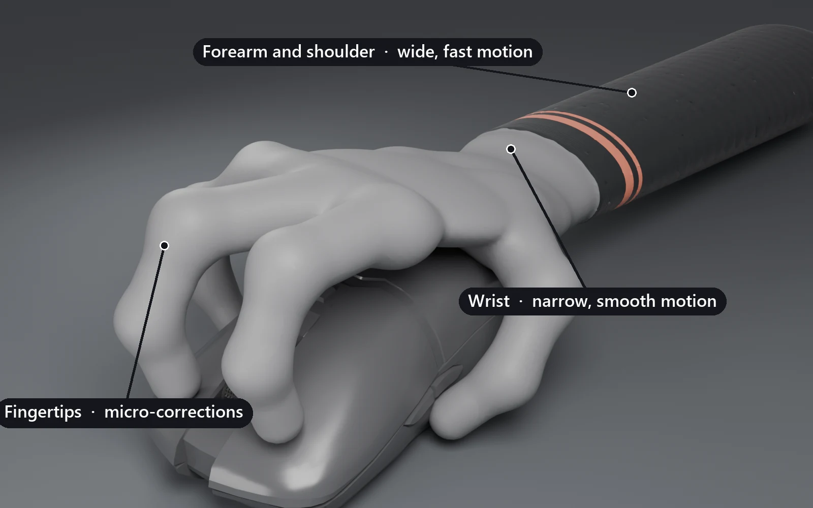
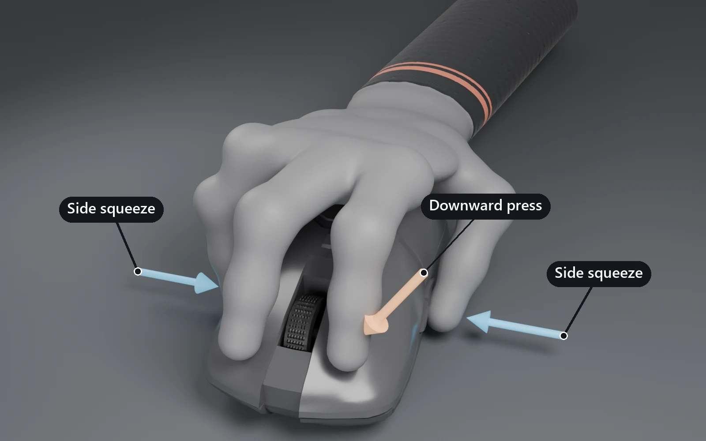

!!! warning "Draft"
    Written from public sources, pending review.

Tension is how hard your hand, wrist and arm work to hold and steer the mouse. Managing it means
using the right amount, in the right place, at the right moment.

- **You need some.** Too tight a grip jitters ahead of the target; too loose a grip lags behind it.[^REF-67]
- **Spend it in bursts.** Tense to start a fast motion, then release before you land.[^REF-77][^REF-74]
- **Put it where the motion is.** Arm for wide motion, wrist for narrow, fingertips for micros.[^REF-70][^REF-71]
- **Read it on screen.** Jitter, overshoot and rushed clicks are often tension before they are aim.[^REF-67][^REF-76]

## What tension is

**A rigid hold for control.** Tension is your hand, wrist and forearm muscles contracting without
moving, which turns them into a firmer structure around the mouse. That structure gives you
control.[^REF-78]

Held for long stretches, the same contraction irritates the muscles doing it. The extreme version
is called [death gripping](../glossary.md#death-grip).[^REF-78]

**A balance, not an enemy.** Aim advice often sounds like tension should be zero. It should not:
using none is as harmful as using too much, and some tension always keeps you stable on a
target.[^REF-67]

The goal is a secure hold that needs little tension and leaves some finger control free.[^REF-73]

**Speed against stability.** More tension makes faster movement possible. It also makes that
movement less stable, which is why a flick needs a lot of it and a micro-correction needs
little.[^REF-77]

**A budget you can overspend.** Tension is a limited resource you spend across your forearm, wrist
and fingertips.[^REF-68] Spend past the limit and you reach lockout, where you lose
control of the whole motion.[^REF-68]

<figure class="aim-figure">
<svg viewBox="0 0 760 250" role="img" aria-labelledby="fig-scale-title"><title id="fig-scale-title">A tension scale from too loose to too tight. Too loose lags behind and stops. Balanced is a firm hold and one continuous motion. Too tight jitters ahead, overcorrects and locks out.</title><defs><marker id="fig-arrow" viewBox="0 0 10 10" refX="9" refY="5" markerWidth="7" markerHeight="7" orient="auto"><path d="M0 0 L10 5 L0 10 Z" class="fig-grid-fill"/></marker></defs><rect x="43.0" y="92" width="220.7" height="16" rx="8" class="fig-cool-fill" opacity="0.85"/><text x="153.33333333333331" y="76" class="fig-ink" text-anchor="middle" font-size="18" font-weight="700">Too loose</text><text x="153.33333333333331" y="144" class="fig-muted" text-anchor="middle" font-size="17" font-weight="500">Lags behind the target</text><text x="153.33333333333331" y="172" class="fig-muted" text-anchor="middle" font-size="17" font-weight="500">Stops and restarts</text><text x="153.33333333333331" y="200" class="fig-muted" text-anchor="middle" font-size="17" font-weight="500">Feels sluggish</text><rect x="269.7" y="92" width="220.7" height="16" rx="8" class="fig-ink-fill" opacity="1"/><text x="379.99999999999994" y="76" class="fig-ink" text-anchor="middle" font-size="18" font-weight="700">Balanced</text><text x="379.99999999999994" y="144" class="fig-muted" text-anchor="middle" font-size="17" font-weight="500">Firm, not hard, hold</text><text x="379.99999999999994" y="172" class="fig-muted" text-anchor="middle" font-size="17" font-weight="500">One continuous motion</text><text x="379.99999999999994" y="200" class="fig-muted" text-anchor="middle" font-size="17" font-weight="500">Releases after a flick</text><rect x="496.3" y="92" width="220.7" height="16" rx="8" class="fig-accent-fill" opacity="0.85"/><text x="606.6666666666666" y="76" class="fig-ink" text-anchor="middle" font-size="18" font-weight="700">Too tight</text><text x="606.6666666666666" y="144" class="fig-muted" text-anchor="middle" font-size="17" font-weight="500">Jitters ahead of the target</text><text x="606.6666666666666" y="172" class="fig-muted" text-anchor="middle" font-size="17" font-weight="500">Skips and overcorrects</text><text x="606.6666666666666" y="200" class="fig-muted" text-anchor="middle" font-size="17" font-weight="500">Tires fast, locks out</text><path d="M371.0 48 L389.0 48 L380.0 58 Z" class="fig-ink-fill"/><text x="40" y="22" class="fig-muted" text-anchor="start" font-size="13" font-weight="500">less grip force</text><text x="720" y="22" class="fig-muted" text-anchor="end" font-size="13" font-weight="500">more grip force</text><path d="M160 18 L600 18" class="fig-grid-stroke" stroke-width="1.5" marker-end="url(#fig-arrow)"/></svg>
<figcaption>The two ends fail differently. A loose hand trails and stalls; a tight hand runs ahead and shakes.</figcaption>
</figure>

## Where tension lives

**Forearm and shoulder: wide and fast.** The arm suits motions that cover distance, and steadying
fast reactions to fast targets.[^REF-70] In precise tracking, you can feel the shoulder carrying the
long strafes.[^REF-72]

**Wrist: narrow and smooth.** The wrist is more efficient for short, narrow motions, such as a target
making short strafes. It is also the joint to favor when smooth tracking matters most.[^REF-70]

**Fingertips: micros.** Small corrections belong in your lower muscle groups, the fingertips or the
wrist, which cuts wasted motion at the end of a fast movement.[^REF-71] In control tracking, fingertip
tension handles vertical adjustments better than the forearm does.[^REF-69]

**Blend the joints.** Moving with arm and fingers together means neither has to work hard, which
takes the edge off tension spikes during large motions.[^REF-74]

**Sensitivity moves the load.** On a low sensitivity, micros shift into the upper muscle groups,
which is easier. It also sidesteps the harder skill of balancing fingertip tension.[^REF-71]

<figure class="aim-figure">

<figcaption>Where each kind of motion draws its tension from.</figcaption>
</figure>

## How the hand holds

Two forces hold the mouse, and players weigh them differently. Neither approach is the one right
answer.

**Side squeeze.** Your thumb pressing against your ring finger or pinky, across the mouse. It gives
stability, most of all on long strafes where speed matching matters.[^REF-72]

Relying on it instead of pushing down keeps tracking from turning sticky, so it is easier to break
out of for a direction change.[^REF-67]

**Downward press.** Your index finger or the base of your palm pushing into the pad. It adds control,
with extra force at direction changes such as the top of a PGT arc.[^REF-72]

Pressing hard into the pad often comes with holding the click. It does not speed up
micro-corrections and can restrict their fluidity.[^REF-75]

**Your grip changes the recipe.** A claw grip holds with a firm, not hard, pinch between thumb, ring
finger and pinky.[^REF-73] A fingertip grip has less support, so it is more prone to lockout and
suits a lighter two-finger pinch.[^REF-73]

<figure class="aim-figure">

<figcaption>Side squeeze and downward press. Players combine them in different proportions.</figcaption>
</figure>

## How to feel it

**Watch the crosshair against the target.** Too much tension shows as sharp, jerky motion that skips
ahead of the target or drifts off course, with a lot of overcorrection.[^REF-67]

Too little shows as stops and breaks in the motion, so the crosshair seems to lag behind and feels
sluggish.[^REF-67]

<figure class="aim-figure">
<svg viewBox="0 0 760 270" role="img" aria-labelledby="fig-tracking-title"><title id="fig-tracking-title">Three graphs of crosshair position against a strafing target over time. Too tight: the crosshair jitters and overshoots ahead at each change of direction. Too loose: it lags behind in stalls and catch-ups. Balanced: it follows the target closely.</title><rect x="30" y="58" width="216" height="150" rx="10" class="fig-panel"/><path d="M42 133.0 L234 133.0" class="fig-grid-stroke" stroke-width="1"/><path d="M42.0 133.0 L42.8 131.3 L43.6 129.7 L44.4 128.0 L45.2 126.3 L46.0 124.7 L46.8 123.1 L47.6 121.4 L48.4 119.8 L49.2 118.2 L50.0 116.6 L50.8 115.0 L51.6 113.5 L52.4 112.0 L53.2 110.4 L54.0 109.0 L54.8 107.5 L55.6 106.1 L56.4 104.7 L57.2 103.3 L58.0 102.0 L58.8 100.6 L59.6 99.4 L60.4 98.1 L61.2 96.9 L62.0 95.8 L62.8 94.7 L63.6 93.6 L64.4 92.5 L65.2 91.5 L66.0 90.6 L66.8 89.7 L67.6 88.8 L68.4 88.0 L69.2 87.3 L70.0 86.5 L70.8 85.9 L71.6 85.3 L72.4 84.7 L73.2 84.2 L74.0 83.7 L74.8 83.3 L75.6 83.0 L76.4 82.7 L77.2 82.4 L78.0 82.2 L78.8 82.1 L79.6 82.0 L80.4 82.0 L81.2 82.0 L82.0 82.1 L82.8 82.2 L83.6 82.4 L84.4 82.7 L85.2 83.0 L86.0 83.3 L86.8 83.7 L87.6 84.2 L88.4 84.7 L89.2 85.3 L90.0 85.9 L90.8 86.5 L91.6 87.3 L92.4 88.0 L93.2 88.8 L94.0 89.7 L94.8 90.6 L95.6 91.5 L96.4 92.5 L97.2 93.6 L98.0 94.7 L98.8 95.8 L99.6 96.9 L100.4 98.1 L101.2 99.4 L102.0 100.6 L102.8 102.0 L103.6 103.3 L104.4 104.7 L105.2 106.1 L106.0 107.5 L106.8 109.0 L107.6 110.4 L108.4 112.0 L109.2 113.5 L110.0 115.0 L110.8 116.6 L111.6 118.2 L112.4 119.8 L113.2 121.4 L114.0 123.1 L114.8 124.7 L115.6 126.3 L116.4 128.0 L117.2 129.7 L118.0 131.3 L118.8 133.0 L119.6 134.7 L120.4 136.3 L121.2 138.0 L122.0 139.7 L122.8 141.3 L123.6 142.9 L124.4 144.6 L125.2 146.2 L126.0 147.8 L126.8 149.4 L127.6 151.0 L128.4 152.5 L129.2 154.0 L130.0 155.6 L130.8 157.0 L131.6 158.5 L132.4 159.9 L133.2 161.3 L134.0 162.7 L134.8 164.0 L135.6 165.4 L136.4 166.6 L137.2 167.9 L138.0 169.1 L138.8 170.2 L139.6 171.3 L140.4 172.4 L141.2 173.5 L142.0 174.5 L142.8 175.4 L143.6 176.3 L144.4 177.2 L145.2 178.0 L146.0 178.7 L146.8 179.5 L147.6 180.1 L148.4 180.7 L149.2 181.3 L150.0 181.8 L150.8 182.3 L151.6 182.7 L152.4 183.0 L153.2 183.3 L154.0 183.6 L154.8 183.8 L155.6 183.9 L156.4 184.0 L157.2 184.0 L158.0 184.0 L158.8 183.9 L159.6 183.8 L160.4 183.6 L161.2 183.3 L162.0 183.0 L162.8 182.7 L163.6 182.3 L164.4 181.8 L165.2 181.3 L166.0 180.7 L166.8 180.1 L167.6 179.5 L168.4 178.7 L169.2 178.0 L170.0 177.2 L170.8 176.3 L171.6 175.4 L172.4 174.5 L173.2 173.5 L174.0 172.4 L174.8 171.3 L175.6 170.2 L176.4 169.1 L177.2 167.9 L178.0 166.6 L178.8 165.4 L179.6 164.0 L180.4 162.7 L181.2 161.3 L182.0 159.9 L182.8 158.5 L183.6 157.0 L184.4 155.6 L185.2 154.0 L186.0 152.5 L186.8 151.0 L187.6 149.4 L188.4 147.8 L189.2 146.2 L190.0 144.6 L190.8 142.9 L191.6 141.3 L192.4 139.7 L193.2 138.0 L194.0 136.3 L194.8 134.7 L195.6 133.0 L196.4 131.3 L197.2 129.7 L198.0 128.0 L198.8 126.3 L199.6 124.7 L200.4 123.1 L201.2 121.4 L202.0 119.8 L202.8 118.2 L203.6 116.6 L204.4 115.0 L205.2 113.5 L206.0 112.0 L206.8 110.4 L207.6 109.0 L208.4 107.5 L209.2 106.1 L210.0 104.7 L210.8 103.3 L211.6 102.0 L212.4 100.6 L213.2 99.4 L214.0 98.1 L214.8 96.9 L215.6 95.8 L216.4 94.7 L217.2 93.6 L218.0 92.5 L218.8 91.5 L219.6 90.6 L220.4 89.7 L221.2 88.8 L222.0 88.0 L222.8 87.3 L223.6 86.5 L224.4 85.9 L225.2 85.3 L226.0 84.7 L226.8 84.2 L227.6 83.7 L228.4 83.3 L229.2 83.0 L230.0 82.7 L230.8 82.4 L231.6 82.2 L232.4 82.1 L233.2 82.0 L234.0 82.0" class="fig-muted-stroke" stroke-width="3" stroke-dasharray="7 6" fill="none"/><path d="M42.0 117.5 L42.8 113.4 L43.6 109.5 L44.4 105.9 L45.2 102.7 L46.0 100.0 L46.8 97.9 L47.6 96.4 L48.4 95.5 L49.2 95.1 L50.0 95.2 L50.8 95.6 L51.6 96.3 L52.4 97.0 L53.2 97.6 L54.0 98.1 L54.8 98.3 L55.6 98.1 L56.4 97.5 L57.2 96.4 L58.0 94.9 L58.8 92.9 L59.6 90.6 L60.4 88.1 L61.2 85.4 L62.0 82.7 L62.8 80.2 L63.6 77.8 L64.4 75.7 L65.2 74.1 L66.0 72.8 L66.8 72.0 L67.6 71.7 L68.4 71.8 L69.2 72.2 L70.0 73.0 L70.8 73.9 L71.6 75.0 L72.4 76.1 L73.2 77.1 L74.0 78.1 L74.8 78.8 L75.6 79.4 L76.4 79.8 L77.2 80.0 L78.0 80.0 L78.8 79.9 L79.6 79.8 L80.4 79.6 L81.2 79.6 L82.0 79.6 L82.8 79.4 L83.6 79.3 L84.4 79.1 L85.2 79.1 L86.0 79.3 L86.8 79.6 L87.6 80.3 L88.4 81.3 L89.2 82.7 L90.0 84.5 L90.8 86.6 L91.6 89.0 L92.4 91.6 L93.2 94.4 L94.0 97.2 L94.8 100.0 L95.6 102.7 L96.4 105.1 L97.2 107.1 L98.0 108.9 L98.8 110.1 L99.6 111.0 L100.4 111.5 L101.2 111.7 L102.0 111.6 L102.8 111.4 L103.6 111.2 L104.4 111.1 L105.2 111.2 L106.0 111.7 L106.8 112.6 L107.6 114.0 L108.4 116.0 L109.2 118.5 L110.0 121.5 L110.8 125.0 L111.6 128.8 L112.4 132.8 L113.2 136.9 L114.0 141.0 L114.8 144.8 L115.6 148.4 L116.4 151.4 L117.2 154.0 L118.0 156.0 L118.8 157.3 L119.6 158.1 L120.4 158.4 L121.2 158.3 L122.0 157.9 L122.8 157.4 L123.6 156.8 L124.4 156.3 L125.2 156.1 L126.0 156.3 L126.8 156.9 L127.6 158.1 L128.4 159.7 L129.2 161.8 L130.0 164.4 L130.8 167.3 L131.6 170.5 L132.4 173.8 L133.2 177.1 L134.0 180.2 L134.8 183.1 L135.6 185.6 L136.4 187.6 L137.2 189.2 L138.0 190.2 L138.8 190.7 L139.6 190.7 L140.4 190.4 L141.2 189.7 L142.0 188.8 L142.8 187.8 L143.6 186.8 L144.4 185.9 L145.2 185.2 L146.0 184.7 L146.8 184.5 L147.6 184.6 L148.4 184.9 L149.2 185.5 L150.0 186.3 L150.8 187.2 L151.6 188.1 L152.4 189.0 L153.2 189.8 L154.0 190.4 L154.8 190.8 L155.6 191.0 L156.4 190.9 L157.2 190.5 L158.0 190.3 L158.8 189.9 L159.6 189.2 L160.4 188.2 L161.2 186.9 L162.0 185.4 L162.8 183.6 L163.6 181.6 L164.4 179.5 L165.2 177.4 L166.0 175.2 L166.8 173.2 L167.6 171.4 L168.4 169.9 L169.2 168.6 L170.0 167.7 L170.8 167.1 L171.6 166.8 L172.4 166.7 L173.2 166.8 L174.0 167.0 L174.8 167.1 L175.6 167.1 L176.4 166.8 L177.2 166.2 L178.0 165.2 L178.8 163.6 L179.6 161.6 L180.4 159.0 L181.2 156.0 L182.0 152.5 L182.8 148.8 L183.6 144.9 L184.4 141.0 L185.2 137.1 L186.0 133.5 L186.8 130.2 L187.6 127.4 L188.4 125.1 L189.2 123.4 L190.0 122.2 L190.8 121.6 L191.6 121.4 L192.4 121.5 L193.2 121.9 L194.0 122.3 L194.8 122.7 L195.6 123.0 L196.4 122.8 L197.2 122.3 L198.0 121.3 L198.8 119.7 L199.6 117.5 L200.4 114.9 L201.2 111.8 L202.0 108.3 L202.8 104.6 L203.6 100.9 L204.4 97.2 L205.2 93.7 L206.0 90.5 L206.8 87.7 L207.6 85.4 L208.4 83.7 L209.2 82.6 L210.0 82.0 L210.8 81.9 L211.6 82.3 L212.4 82.9 L213.2 83.7 L214.0 84.6 L214.8 85.4 L215.6 86.1 L216.4 86.5 L217.2 86.7 L218.0 86.4 L218.8 85.8 L219.6 84.8 L220.4 83.6 L221.2 82.1 L222.0 80.4 L222.8 78.7 L223.6 77.0 L224.4 75.5 L225.2 74.1 L226.0 73.0 L226.8 72.3 L227.6 71.9 L228.4 71.8 L229.2 72.1 L230.0 72.7 L230.8 73.5 L231.6 74.5 L232.4 75.7 L233.2 76.8 L234.0 78.0" class="fig-accent-stroke" stroke-width="3.2" fill="none" stroke-linejoin="round"/><text x="138.0" y="40" class="fig-ink" text-anchor="middle" font-size="18" font-weight="700">Too tight</text><text x="138.0" y="232" class="fig-muted" text-anchor="middle" font-size="13" font-weight="500">time</text><rect x="272" y="58" width="216" height="150" rx="10" class="fig-panel"/><path d="M284 133.0 L476 133.0" class="fig-grid-stroke" stroke-width="1"/><path d="M284.0 133.0 L284.8 131.3 L285.6 129.7 L286.4 128.0 L287.2 126.3 L288.0 124.7 L288.8 123.1 L289.6 121.4 L290.4 119.8 L291.2 118.2 L292.0 116.6 L292.8 115.0 L293.6 113.5 L294.4 112.0 L295.2 110.4 L296.0 109.0 L296.8 107.5 L297.6 106.1 L298.4 104.7 L299.2 103.3 L300.0 102.0 L300.8 100.6 L301.6 99.4 L302.4 98.1 L303.2 96.9 L304.0 95.8 L304.8 94.7 L305.6 93.6 L306.4 92.5 L307.2 91.5 L308.0 90.6 L308.8 89.7 L309.6 88.8 L310.4 88.0 L311.2 87.3 L312.0 86.5 L312.8 85.9 L313.6 85.3 L314.4 84.7 L315.2 84.2 L316.0 83.7 L316.8 83.3 L317.6 83.0 L318.4 82.7 L319.2 82.4 L320.0 82.2 L320.8 82.1 L321.6 82.0 L322.4 82.0 L323.2 82.0 L324.0 82.1 L324.8 82.2 L325.6 82.4 L326.4 82.7 L327.2 83.0 L328.0 83.3 L328.8 83.7 L329.6 84.2 L330.4 84.7 L331.2 85.3 L332.0 85.9 L332.8 86.5 L333.6 87.3 L334.4 88.0 L335.2 88.8 L336.0 89.7 L336.8 90.6 L337.6 91.5 L338.4 92.5 L339.2 93.6 L340.0 94.7 L340.8 95.8 L341.6 96.9 L342.4 98.1 L343.2 99.4 L344.0 100.6 L344.8 102.0 L345.6 103.3 L346.4 104.7 L347.2 106.1 L348.0 107.5 L348.8 109.0 L349.6 110.4 L350.4 112.0 L351.2 113.5 L352.0 115.0 L352.8 116.6 L353.6 118.2 L354.4 119.8 L355.2 121.4 L356.0 123.1 L356.8 124.7 L357.6 126.3 L358.4 128.0 L359.2 129.7 L360.0 131.3 L360.8 133.0 L361.6 134.7 L362.4 136.3 L363.2 138.0 L364.0 139.7 L364.8 141.3 L365.6 142.9 L366.4 144.6 L367.2 146.2 L368.0 147.8 L368.8 149.4 L369.6 151.0 L370.4 152.5 L371.2 154.0 L372.0 155.6 L372.8 157.0 L373.6 158.5 L374.4 159.9 L375.2 161.3 L376.0 162.7 L376.8 164.0 L377.6 165.4 L378.4 166.6 L379.2 167.9 L380.0 169.1 L380.8 170.2 L381.6 171.3 L382.4 172.4 L383.2 173.5 L384.0 174.5 L384.8 175.4 L385.6 176.3 L386.4 177.2 L387.2 178.0 L388.0 178.7 L388.8 179.5 L389.6 180.1 L390.4 180.7 L391.2 181.3 L392.0 181.8 L392.8 182.3 L393.6 182.7 L394.4 183.0 L395.2 183.3 L396.0 183.6 L396.8 183.8 L397.6 183.9 L398.4 184.0 L399.2 184.0 L400.0 184.0 L400.8 183.9 L401.6 183.8 L402.4 183.6 L403.2 183.3 L404.0 183.0 L404.8 182.7 L405.6 182.3 L406.4 181.8 L407.2 181.3 L408.0 180.7 L408.8 180.1 L409.6 179.5 L410.4 178.7 L411.2 178.0 L412.0 177.2 L412.8 176.3 L413.6 175.4 L414.4 174.5 L415.2 173.5 L416.0 172.4 L416.8 171.3 L417.6 170.2 L418.4 169.1 L419.2 167.9 L420.0 166.6 L420.8 165.4 L421.6 164.0 L422.4 162.7 L423.2 161.3 L424.0 159.9 L424.8 158.5 L425.6 157.0 L426.4 155.6 L427.2 154.0 L428.0 152.5 L428.8 151.0 L429.6 149.4 L430.4 147.8 L431.2 146.2 L432.0 144.6 L432.8 142.9 L433.6 141.3 L434.4 139.7 L435.2 138.0 L436.0 136.3 L436.8 134.7 L437.6 133.0 L438.4 131.3 L439.2 129.7 L440.0 128.0 L440.8 126.3 L441.6 124.7 L442.4 123.1 L443.2 121.4 L444.0 119.8 L444.8 118.2 L445.6 116.6 L446.4 115.0 L447.2 113.5 L448.0 112.0 L448.8 110.4 L449.6 109.0 L450.4 107.5 L451.2 106.1 L452.0 104.7 L452.8 103.3 L453.6 102.0 L454.4 100.6 L455.2 99.4 L456.0 98.1 L456.8 96.9 L457.6 95.8 L458.4 94.7 L459.2 93.6 L460.0 92.5 L460.8 91.5 L461.6 90.6 L462.4 89.7 L463.2 88.8 L464.0 88.0 L464.8 87.3 L465.6 86.5 L466.4 85.9 L467.2 85.3 L468.0 84.7 L468.8 84.2 L469.6 83.7 L470.4 83.3 L471.2 83.0 L472.0 82.7 L472.8 82.4 L473.6 82.2 L474.4 82.1 L475.2 82.0 L476.0 82.0" class="fig-muted-stroke" stroke-width="3" stroke-dasharray="7 6" fill="none"/><path d="M284.0 156.9 L284.8 156.9 L285.6 156.9 L286.4 156.9 L287.2 156.9 L288.0 156.9 L288.8 156.9 L289.6 156.9 L290.4 156.9 L291.2 156.9 L292.0 156.9 L292.8 156.9 L293.6 156.9 L294.4 156.9 L295.2 156.9 L296.0 133.0 L296.8 133.0 L297.6 133.0 L298.4 133.0 L299.2 133.0 L300.0 133.0 L300.8 133.0 L301.6 133.0 L302.4 133.0 L303.2 133.0 L304.0 133.0 L304.8 133.0 L305.6 133.0 L306.4 133.0 L307.2 133.0 L308.0 133.0 L308.8 133.0 L309.6 109.1 L310.4 109.1 L311.2 109.1 L312.0 109.1 L312.8 109.1 L313.6 109.1 L314.4 109.1 L315.2 109.1 L316.0 109.1 L316.8 109.1 L317.6 109.1 L318.4 109.1 L319.2 109.1 L320.0 109.1 L320.8 109.1 L321.6 109.1 L322.4 109.1 L323.2 92.6 L324.0 92.6 L324.8 92.6 L325.6 92.6 L326.4 92.6 L327.2 92.6 L328.0 92.6 L328.8 92.6 L329.6 92.6 L330.4 92.6 L331.2 92.6 L332.0 92.6 L332.8 92.6 L333.6 92.6 L334.4 92.6 L335.2 92.6 L336.0 92.6 L336.8 88.4 L337.6 88.4 L338.4 88.4 L339.2 88.4 L340.0 88.4 L340.8 88.4 L341.6 88.4 L342.4 88.4 L343.2 88.4 L344.0 88.4 L344.8 88.4 L345.6 88.4 L346.4 88.4 L347.2 88.4 L348.0 88.4 L348.8 88.4 L349.6 88.4 L350.4 97.9 L351.2 97.9 L352.0 97.9 L352.8 97.9 L353.6 97.9 L354.4 97.9 L355.2 97.9 L356.0 97.9 L356.8 97.9 L357.6 97.9 L358.4 97.9 L359.2 97.9 L360.0 97.9 L360.8 97.9 L361.6 97.9 L362.4 97.9 L363.2 97.9 L364.0 97.9 L364.8 118.2 L365.6 118.2 L366.4 118.2 L367.2 118.2 L368.0 118.2 L368.8 118.2 L369.6 118.2 L370.4 118.2 L371.2 118.2 L372.0 118.2 L372.8 118.2 L373.6 118.2 L374.4 118.2 L375.2 118.2 L376.0 118.2 L376.8 118.2 L377.6 118.2 L378.4 143.0 L379.2 143.0 L380.0 143.0 L380.8 143.0 L381.6 143.0 L382.4 143.0 L383.2 143.0 L384.0 143.0 L384.8 143.0 L385.6 143.0 L386.4 143.0 L387.2 143.0 L388.0 143.0 L388.8 143.0 L389.6 143.0 L390.4 143.0 L391.2 143.0 L392.0 164.7 L392.8 164.7 L393.6 164.7 L394.4 164.7 L395.2 164.7 L396.0 164.7 L396.8 164.7 L397.6 164.7 L398.4 164.7 L399.2 164.7 L400.0 164.7 L400.8 164.7 L401.6 164.7 L402.4 164.7 L403.2 164.7 L404.0 164.7 L404.8 164.7 L405.6 176.8 L406.4 176.8 L407.2 176.8 L408.0 176.8 L408.8 176.8 L409.6 176.8 L410.4 176.8 L411.2 176.8 L412.0 176.8 L412.8 176.8 L413.6 176.8 L414.4 176.8 L415.2 176.8 L416.0 176.8 L416.8 176.8 L417.6 176.8 L418.4 176.8 L419.2 175.4 L420.0 175.4 L420.8 175.4 L421.6 175.4 L422.4 175.4 L423.2 175.4 L424.0 175.4 L424.8 175.4 L425.6 175.4 L426.4 175.4 L427.2 175.4 L428.0 175.4 L428.8 175.4 L429.6 175.4 L430.4 175.4 L431.2 175.4 L432.0 175.4 L432.8 161.0 L433.6 161.0 L434.4 161.0 L435.2 161.0 L436.0 161.0 L436.8 161.0 L437.6 161.0 L438.4 161.0 L439.2 161.0 L440.0 161.0 L440.8 161.0 L441.6 161.0 L442.4 161.0 L443.2 161.0 L444.0 161.0 L444.8 161.0 L445.6 161.0 L446.4 138.0 L447.2 138.0 L448.0 138.0 L448.8 138.0 L449.6 138.0 L450.4 138.0 L451.2 138.0 L452.0 138.0 L452.8 138.0 L453.6 138.0 L454.4 138.0 L455.2 138.0 L456.0 138.0 L456.8 138.0 L457.6 138.0 L458.4 138.0 L459.2 138.0 L460.0 138.0 L460.8 113.5 L461.6 113.5 L462.4 113.5 L463.2 113.5 L464.0 113.5 L464.8 113.5 L465.6 113.5 L466.4 113.5 L467.2 113.5 L468.0 113.5 L468.8 113.5 L469.6 113.5 L470.4 113.5 L471.2 113.5 L472.0 113.5 L472.8 113.5 L473.6 113.5 L474.4 95.0 L475.2 95.0 L476.0 95.0" class="fig-cool-stroke" stroke-width="3.2" fill="none" stroke-linejoin="round"/><text x="380.0" y="40" class="fig-ink" text-anchor="middle" font-size="18" font-weight="700">Too loose</text><text x="380.0" y="232" class="fig-muted" text-anchor="middle" font-size="13" font-weight="500">time</text><rect x="514" y="58" width="216" height="150" rx="10" class="fig-panel"/><path d="M526 133.0 L718 133.0" class="fig-grid-stroke" stroke-width="1"/><path d="M526.0 133.0 L526.8 131.3 L527.6 129.7 L528.4 128.0 L529.2 126.3 L530.0 124.7 L530.8 123.1 L531.6 121.4 L532.4 119.8 L533.2 118.2 L534.0 116.6 L534.8 115.0 L535.6 113.5 L536.4 112.0 L537.2 110.4 L538.0 109.0 L538.8 107.5 L539.6 106.1 L540.4 104.7 L541.2 103.3 L542.0 102.0 L542.8 100.6 L543.6 99.4 L544.4 98.1 L545.2 96.9 L546.0 95.8 L546.8 94.7 L547.6 93.6 L548.4 92.5 L549.2 91.5 L550.0 90.6 L550.8 89.7 L551.6 88.8 L552.4 88.0 L553.2 87.3 L554.0 86.5 L554.8 85.9 L555.6 85.3 L556.4 84.7 L557.2 84.2 L558.0 83.7 L558.8 83.3 L559.6 83.0 L560.4 82.7 L561.2 82.4 L562.0 82.2 L562.8 82.1 L563.6 82.0 L564.4 82.0 L565.2 82.0 L566.0 82.1 L566.8 82.2 L567.6 82.4 L568.4 82.7 L569.2 83.0 L570.0 83.3 L570.8 83.7 L571.6 84.2 L572.4 84.7 L573.2 85.3 L574.0 85.9 L574.8 86.5 L575.6 87.3 L576.4 88.0 L577.2 88.8 L578.0 89.7 L578.8 90.6 L579.6 91.5 L580.4 92.5 L581.2 93.6 L582.0 94.7 L582.8 95.8 L583.6 96.9 L584.4 98.1 L585.2 99.4 L586.0 100.6 L586.8 102.0 L587.6 103.3 L588.4 104.7 L589.2 106.1 L590.0 107.5 L590.8 109.0 L591.6 110.4 L592.4 112.0 L593.2 113.5 L594.0 115.0 L594.8 116.6 L595.6 118.2 L596.4 119.8 L597.2 121.4 L598.0 123.1 L598.8 124.7 L599.6 126.3 L600.4 128.0 L601.2 129.7 L602.0 131.3 L602.8 133.0 L603.6 134.7 L604.4 136.3 L605.2 138.0 L606.0 139.7 L606.8 141.3 L607.6 142.9 L608.4 144.6 L609.2 146.2 L610.0 147.8 L610.8 149.4 L611.6 151.0 L612.4 152.5 L613.2 154.0 L614.0 155.6 L614.8 157.0 L615.6 158.5 L616.4 159.9 L617.2 161.3 L618.0 162.7 L618.8 164.0 L619.6 165.4 L620.4 166.6 L621.2 167.9 L622.0 169.1 L622.8 170.2 L623.6 171.3 L624.4 172.4 L625.2 173.5 L626.0 174.5 L626.8 175.4 L627.6 176.3 L628.4 177.2 L629.2 178.0 L630.0 178.7 L630.8 179.5 L631.6 180.1 L632.4 180.7 L633.2 181.3 L634.0 181.8 L634.8 182.3 L635.6 182.7 L636.4 183.0 L637.2 183.3 L638.0 183.6 L638.8 183.8 L639.6 183.9 L640.4 184.0 L641.2 184.0 L642.0 184.0 L642.8 183.9 L643.6 183.8 L644.4 183.6 L645.2 183.3 L646.0 183.0 L646.8 182.7 L647.6 182.3 L648.4 181.8 L649.2 181.3 L650.0 180.7 L650.8 180.1 L651.6 179.5 L652.4 178.7 L653.2 178.0 L654.0 177.2 L654.8 176.3 L655.6 175.4 L656.4 174.5 L657.2 173.5 L658.0 172.4 L658.8 171.3 L659.6 170.2 L660.4 169.1 L661.2 167.9 L662.0 166.6 L662.8 165.4 L663.6 164.0 L664.4 162.7 L665.2 161.3 L666.0 159.9 L666.8 158.5 L667.6 157.0 L668.4 155.6 L669.2 154.0 L670.0 152.5 L670.8 151.0 L671.6 149.4 L672.4 147.8 L673.2 146.2 L674.0 144.6 L674.8 142.9 L675.6 141.3 L676.4 139.7 L677.2 138.0 L678.0 136.3 L678.8 134.7 L679.6 133.0 L680.4 131.3 L681.2 129.7 L682.0 128.0 L682.8 126.3 L683.6 124.7 L684.4 123.1 L685.2 121.4 L686.0 119.8 L686.8 118.2 L687.6 116.6 L688.4 115.0 L689.2 113.5 L690.0 112.0 L690.8 110.4 L691.6 109.0 L692.4 107.5 L693.2 106.1 L694.0 104.7 L694.8 103.3 L695.6 102.0 L696.4 100.6 L697.2 99.4 L698.0 98.1 L698.8 96.9 L699.6 95.8 L700.4 94.7 L701.2 93.6 L702.0 92.5 L702.8 91.5 L703.6 90.6 L704.4 89.7 L705.2 88.8 L706.0 88.0 L706.8 87.3 L707.6 86.5 L708.4 85.9 L709.2 85.3 L710.0 84.7 L710.8 84.2 L711.6 83.7 L712.4 83.3 L713.2 83.0 L714.0 82.7 L714.8 82.4 L715.6 82.2 L716.4 82.1 L717.2 82.0 L718.0 82.0" class="fig-muted-stroke" stroke-width="3" stroke-dasharray="7 6" fill="none"/><path d="M526.0 136.1 L526.8 134.3 L527.6 132.5 L528.4 130.7 L529.2 128.9 L530.0 127.1 L530.8 125.3 L531.6 123.6 L532.4 121.9 L533.2 120.3 L534.0 118.7 L534.8 117.1 L535.6 115.6 L536.4 114.1 L537.2 112.7 L538.0 111.4 L538.8 110.0 L539.6 108.7 L540.4 107.5 L541.2 106.3 L542.0 105.1 L542.8 104.0 L543.6 102.9 L544.4 101.8 L545.2 100.7 L546.0 99.6 L546.8 98.6 L547.6 97.6 L548.4 96.5 L549.2 95.5 L550.0 94.5 L550.8 93.6 L551.6 92.6 L552.4 91.6 L553.2 90.7 L554.0 89.8 L554.8 88.9 L555.6 88.0 L556.4 87.2 L557.2 86.4 L558.0 85.6 L558.8 84.9 L559.6 84.3 L560.4 83.7 L561.2 83.2 L562.0 82.8 L562.8 82.4 L563.6 82.1 L564.4 81.9 L565.2 81.8 L566.0 81.7 L566.8 81.8 L567.6 81.9 L568.4 82.1 L569.2 82.4 L570.0 82.8 L570.8 83.3 L571.6 83.8 L572.4 84.4 L573.2 85.0 L574.0 85.7 L574.8 86.5 L575.6 87.3 L576.4 88.1 L577.2 89.0 L578.0 89.9 L578.8 90.8 L579.6 91.8 L580.4 92.7 L581.2 93.7 L582.0 94.7 L582.8 95.7 L583.6 96.7 L584.4 97.7 L585.2 98.8 L586.0 99.8 L586.8 100.9 L587.6 102.0 L588.4 103.1 L589.2 104.2 L590.0 105.3 L590.8 106.5 L591.6 107.7 L592.4 109.0 L593.2 110.3 L594.0 111.6 L594.8 113.0 L595.6 114.4 L596.4 115.8 L597.2 117.4 L598.0 118.9 L598.8 120.5 L599.6 122.2 L600.4 123.9 L601.2 125.6 L602.0 127.3 L602.8 129.1 L603.6 130.9 L604.4 132.7 L605.2 134.6 L606.0 136.4 L606.8 138.2 L607.6 140.0 L608.4 141.8 L609.2 143.6 L610.0 145.4 L610.8 147.1 L611.6 148.8 L612.4 150.4 L613.2 152.0 L614.0 153.5 L614.8 155.0 L615.6 156.4 L616.4 157.8 L617.2 159.1 L618.0 160.4 L618.8 161.6 L619.6 162.8 L620.4 163.9 L621.2 165.0 L622.0 166.1 L622.8 167.1 L623.6 168.0 L624.4 169.0 L625.2 169.9 L626.0 170.8 L626.8 171.7 L627.6 172.6 L628.4 173.4 L629.2 174.3 L630.0 175.1 L630.8 175.9 L631.6 176.7 L632.4 177.4 L633.2 178.2 L634.0 178.9 L634.8 179.6 L635.6 180.3 L636.4 180.9 L637.2 181.5 L638.0 182.0 L638.8 182.5 L639.6 183.0 L640.4 183.3 L641.2 183.6 L642.0 183.9 L642.8 184.0 L643.6 184.1 L644.4 184.1 L645.2 184.0 L646.0 183.8 L646.8 183.6 L647.6 183.2 L648.4 182.8 L649.2 182.3 L650.0 181.7 L650.8 181.0 L651.6 180.3 L652.4 179.5 L653.2 178.7 L654.0 177.8 L654.8 176.8 L655.6 175.8 L656.4 174.8 L657.2 173.7 L658.0 172.6 L658.8 171.5 L659.6 170.4 L660.4 169.3 L661.2 168.1 L662.0 167.0 L662.8 165.8 L663.6 164.6 L664.4 163.5 L665.2 162.3 L666.0 161.1 L666.8 159.9 L667.6 158.7 L668.4 157.5 L669.2 156.2 L670.0 155.0 L670.8 153.7 L671.6 152.4 L672.4 151.1 L673.2 149.7 L674.0 148.3 L674.8 146.8 L675.6 145.4 L676.4 143.8 L677.2 142.3 L678.0 140.7 L678.8 139.0 L679.6 137.4 L680.4 135.6 L681.2 133.9 L682.0 132.1 L682.8 130.4 L683.6 128.5 L684.4 126.7 L685.2 124.9 L686.0 123.1 L686.8 121.3 L687.6 119.5 L688.4 117.8 L689.2 116.1 L690.0 114.4 L690.8 112.7 L691.6 111.1 L692.4 109.6 L693.2 108.1 L694.0 106.6 L694.8 105.2 L695.6 103.9 L696.4 102.6 L697.2 101.4 L698.0 100.3 L698.8 99.2 L699.6 98.2 L700.4 97.2 L701.2 96.2 L702.0 95.3 L702.8 94.5 L703.6 93.7 L704.4 92.9 L705.2 92.1 L706.0 91.4 L706.8 90.7 L707.6 90.0 L708.4 89.3 L709.2 88.7 L710.0 88.0 L710.8 87.4 L711.6 86.8 L712.4 86.3 L713.2 85.7 L714.0 85.2 L714.8 84.7 L715.6 84.2 L716.4 83.8 L717.2 83.4 L718.0 83.1" class="fig-ink-stroke" stroke-width="3.2" fill="none" stroke-linejoin="round"/><text x="622.0" y="40" class="fig-ink" text-anchor="middle" font-size="18" font-weight="700">Balanced</text><text x="622.0" y="232" class="fig-muted" text-anchor="middle" font-size="13" font-weight="500">time</text><path d="M250 249 L290 249" class="fig-muted-stroke" stroke-width="3" stroke-dasharray="7 6"/><text x="298" y="254" class="fig-muted" text-anchor="start" font-size="14" font-weight="500">target</text><path d="M400 249 L440 249" class="fig-ink-stroke" stroke-width="3.2"/><text x="448" y="254" class="fig-muted" text-anchor="start" font-size="14" font-weight="500">your crosshair</text></svg>
<figcaption>The same strafing target, tracked three ways. Tight overshoots at each turn, loose stalls and catches up.</figcaption>
</figure>

**Watch your clicks.** Shooting the instant you react spikes tension and makes the motion shaky.[^REF-76]
Relying on heavy tension also raises the urge to spam click.[^REF-75]

**Watch your flicks.** Curved flicks, or sluggish movement between targets, point to tension you did
not prepare before the flick.[^REF-74] Flicking past targets wastes tension and runs you into lockout
quickly.[^REF-74]

**Watch for changes, not only amounts.** Changes in how much tension you use, or where, line up with
breaks in smoothness.[^REF-67] If a track breaks at the same point every strafe, check what your hand
did there.

**Look at your fingertips.** Pressing turns the skin of a fingertip pale, so that color change shows
how much pressure a single finger is applying.[^REF-73]

**Rate your grip.** Picture your grip on a scale from 1 to 10. Anything past 8 out of 10 is the grip
to train yourself out of.[^REF-78]

**Treat pain as a signal.** Pain from gripping hard signals inflamed tendons. Build tendon endurance
so the problem does not become lasting damage.[^REF-78]

## How to control it

**Start from a stable baseline.** A firm grip that needs little effort to maintain.[^REF-73] During a
long strafe, keep that tension constant instead of adjusting it mid-track.[^REF-67]

**Tense, flick, release.** Use a lot of tension to start a flick, release it as you approach the
target, and keep only a little for the micro-correction.[^REF-77]

Think of the cycle as breathing: prepare the tension for the next flick, flick, then relax.[^REF-74]
Do not shoot until the next flick is prepared, and do not stay tense for long.[^REF-74]

<figure class="aim-figure">
<svg viewBox="0 0 760 300" role="img" aria-labelledby="fig-flick-title"><title id="fig-flick-title">Tension over one flick. A managed flick builds tension while preparing, peaks during the flick, releases before landing, stays low for the micro-correction, and builds again for the next flick. A held flick keeps tension high through the landing and drifts into lockout.</title><rect x="70" y="50.0" width="660" height="23.8" class="fig-accent-fill" opacity="0.14"/><text x="80" y="67.0" class="fig-accent-text" text-anchor="start" font-size="13" font-weight="700">lockout</text><text x="129.4" y="248" class="fig-muted" text-anchor="middle" font-size="14" font-weight="600">Prepare</text><path d="M188.8 44 L188.8 220" class="fig-grid-stroke" stroke-width="1" stroke-dasharray="3 5"/><text x="248.20000000000002" y="248" class="fig-muted" text-anchor="middle" font-size="14" font-weight="600">Flick</text><path d="M307.6 44 L307.6 220" class="fig-grid-stroke" stroke-width="1" stroke-dasharray="3 5"/><text x="353.8" y="248" class="fig-muted" text-anchor="middle" font-size="14" font-weight="600">Release</text><path d="M400.0 44 L400.0 220" class="fig-grid-stroke" stroke-width="1" stroke-dasharray="3 5"/><text x="472.6" y="248" class="fig-muted" text-anchor="middle" font-size="14" font-weight="600">Micro</text><path d="M545.2 44 L545.2 220" class="fig-grid-stroke" stroke-width="1" stroke-dasharray="3 5"/><text x="571.6" y="248" class="fig-muted" text-anchor="middle" font-size="14" font-weight="600">Shoot</text><path d="M598.0 44 L598.0 220" class="fig-grid-stroke" stroke-width="1" stroke-dasharray="3 5"/><text x="664.0" y="248" class="fig-muted" text-anchor="middle" font-size="14" font-weight="600">Prepare</text><path d="M70 220 L730 220 M70 220 L70 40" class="fig-grid-stroke" stroke-width="1.5"/><text transform="rotate(-90 24 135.0)" x="24" y="135.0" class="fig-muted" text-anchor="middle" font-size="13" font-weight="500">tension</text><path d="M70.0 186.0 L72.2 185.9 L74.4 185.7 L76.6 185.4 L78.8 185.0 L81.0 184.5 L83.2 183.8 L85.4 183.1 L87.6 182.2 L89.8 181.3 L92.0 180.3 L94.2 179.2 L96.4 178.0 L98.6 176.8 L100.8 175.5 L103.0 174.2 L105.2 172.8 L107.4 171.3 L109.6 169.9 L111.8 168.4 L114.0 166.8 L116.2 165.3 L118.4 163.7 L120.6 162.1 L122.8 160.5 L125.0 158.9 L127.2 157.3 L129.4 155.7 L131.6 154.2 L133.8 152.6 L136.0 151.1 L138.2 149.7 L140.4 148.2 L142.6 146.8 L144.8 145.5 L147.0 144.2 L149.2 143.0 L151.4 141.8 L153.6 140.7 L155.8 139.7 L158.0 138.8 L160.2 137.9 L162.4 137.2 L164.6 136.5 L166.8 136.0 L169.0 135.6 L171.2 135.3 L173.4 135.1 L175.6 135.0 L177.8 134.8 L180.0 134.4 L182.2 133.6 L184.4 132.5 L186.6 131.2 L188.8 129.7 L191.0 128.0 L193.2 126.1 L195.4 124.0 L197.6 121.8 L199.8 119.5 L202.0 117.0 L204.2 114.6 L206.4 112.0 L208.6 109.5 L210.8 107.0 L213.0 104.4 L215.2 102.0 L217.4 99.5 L219.6 97.2 L221.8 95.0 L224.0 92.9 L226.2 91.0 L228.4 89.3 L230.6 87.8 L232.8 86.5 L235.0 85.4 L237.2 84.6 L239.4 84.2 L241.6 84.0 L243.8 84.0 L246.0 84.0 L248.2 84.0 L250.4 84.0 L252.6 84.0 L254.8 84.0 L257.0 84.0 L259.2 84.0 L261.4 84.0 L263.6 84.0 L265.8 84.0 L268.0 84.0 L270.2 84.0 L272.4 84.0 L274.6 84.0 L276.8 84.0 L279.0 84.0 L281.2 84.0 L283.4 84.0 L285.6 84.0 L287.8 84.0 L290.0 84.0 L292.2 84.0 L294.4 84.0 L296.6 84.0 L298.8 84.0 L301.0 84.0 L303.2 84.0 L305.4 84.0 L307.6 84.0 L309.8 84.0 L312.0 84.0 L314.2 84.0 L316.4 84.0 L318.6 84.0 L320.8 84.0 L323.0 84.0 L325.2 84.0 L327.4 84.0 L329.6 84.0 L331.8 84.0 L334.0 84.0 L336.2 84.0 L338.4 83.9 L340.6 83.8 L342.8 83.7 L345.0 83.5 L347.2 83.3 L349.4 83.1 L351.6 82.8 L353.8 82.5 L356.0 82.2 L358.2 81.9 L360.4 81.6 L362.6 81.3 L364.8 80.9 L367.0 80.6 L369.2 80.3 L371.4 79.9 L373.6 79.6 L375.8 79.3 L378.0 79.0 L380.2 78.7 L382.4 78.4 L384.6 78.1 L386.8 77.9 L389.0 77.7 L391.2 77.5 L393.4 77.4 L395.6 77.3 L397.8 77.2 L400.0 77.2 L402.2 77.2 L404.4 77.2 L406.6 77.1 L408.8 77.1 L411.0 77.0 L413.2 77.0 L415.4 76.9 L417.6 76.8 L419.8 76.7 L422.0 76.6 L424.2 76.4 L426.4 76.3 L428.6 76.2 L430.8 76.0 L433.0 75.9 L435.2 75.7 L437.4 75.5 L439.6 75.3 L441.8 75.2 L444.0 75.0 L446.2 74.8 L448.4 74.6 L450.6 74.3 L452.8 74.1 L455.0 73.9 L457.2 73.7 L459.4 73.5 L461.6 73.3 L463.8 73.0 L466.0 72.8 L468.2 72.6 L470.4 72.3 L472.6 72.1 L474.8 71.9 L477.0 71.6 L479.2 71.4 L481.4 71.2 L483.6 70.9 L485.8 70.7 L488.0 70.5 L490.2 70.3 L492.4 70.1 L494.6 69.9 L496.8 69.6 L499.0 69.4 L501.2 69.2 L503.4 69.0 L505.6 68.9 L507.8 68.7 L510.0 68.5 L512.2 68.3 L514.4 68.2 L516.6 68.0 L518.8 67.9 L521.0 67.8 L523.2 67.6 L525.4 67.5 L527.6 67.4 L529.8 67.3 L532.0 67.2 L534.2 67.2 L536.4 67.1 L538.6 67.1 L540.8 67.0 L543.0 67.0 L545.2 67.0 L547.4 67.0 L549.6 66.9 L551.8 66.8 L554.0 66.6 L556.2 66.4 L558.4 66.2 L560.6 66.0 L562.8 65.7 L565.0 65.4 L567.2 65.1 L569.4 64.8 L571.6 64.4 L573.8 64.1 L576.0 63.8 L578.2 63.5 L580.4 63.2 L582.6 62.9 L584.8 62.7 L587.0 62.5 L589.2 62.3 L591.4 62.1 L593.6 62.0 L595.8 61.9 L598.0 61.9 L600.2 61.9 L602.4 61.9 L604.6 61.9 L606.8 61.8 L609.0 61.8 L611.2 61.8 L613.4 61.7 L615.6 61.6 L617.8 61.6 L620.0 61.5 L622.2 61.4 L624.4 61.4 L626.6 61.3 L628.8 61.2 L631.0 61.1 L633.2 61.0 L635.4 60.9 L637.6 60.8 L639.8 60.7 L642.0 60.6 L644.2 60.5 L646.4 60.4 L648.6 60.3 L650.8 60.2 L653.0 60.1 L655.2 60.0 L657.4 59.9 L659.6 59.8 L661.8 59.7 L664.0 59.6 L666.2 59.5 L668.4 59.4 L670.6 59.3 L672.8 59.2 L675.0 59.1 L677.2 59.0 L679.4 59.0 L681.6 58.9 L683.8 58.8 L686.0 58.8 L688.2 58.7 L690.4 58.6 L692.6 58.6 L694.8 58.6 L697.0 58.5 L699.2 58.5 L701.4 58.5 L703.6 58.5 L705.8 58.5 L708.0 58.4 L710.2 58.2 L712.4 58.1 L714.6 57.9 L716.8 57.7 L719.0 57.4 L721.2 57.2 L723.4 57.1 L725.6 56.9 L727.8 56.8 L730.0 56.8" class="fig-accent-stroke" stroke-width="3" stroke-dasharray="8 6" fill="none"/><path d="M70.0 186.0 L72.2 185.9 L74.4 185.7 L76.6 185.4 L78.8 185.0 L81.0 184.5 L83.2 183.8 L85.4 183.1 L87.6 182.2 L89.8 181.3 L92.0 180.3 L94.2 179.2 L96.4 178.0 L98.6 176.8 L100.8 175.5 L103.0 174.2 L105.2 172.8 L107.4 171.3 L109.6 169.9 L111.8 168.4 L114.0 166.8 L116.2 165.3 L118.4 163.7 L120.6 162.1 L122.8 160.5 L125.0 158.9 L127.2 157.3 L129.4 155.7 L131.6 154.2 L133.8 152.6 L136.0 151.1 L138.2 149.7 L140.4 148.2 L142.6 146.8 L144.8 145.5 L147.0 144.2 L149.2 143.0 L151.4 141.8 L153.6 140.7 L155.8 139.7 L158.0 138.8 L160.2 137.9 L162.4 137.2 L164.6 136.5 L166.8 136.0 L169.0 135.6 L171.2 135.3 L173.4 135.1 L175.6 135.0 L177.8 134.8 L180.0 134.4 L182.2 133.6 L184.4 132.5 L186.6 131.2 L188.8 129.7 L191.0 128.0 L193.2 126.1 L195.4 124.0 L197.6 121.8 L199.8 119.5 L202.0 117.0 L204.2 114.6 L206.4 112.0 L208.6 109.5 L210.8 107.0 L213.0 104.4 L215.2 102.0 L217.4 99.5 L219.6 97.2 L221.8 95.0 L224.0 92.9 L226.2 91.0 L228.4 89.3 L230.6 87.8 L232.8 86.5 L235.0 85.4 L237.2 84.6 L239.4 84.2 L241.6 84.0 L243.8 84.1 L246.0 84.5 L248.2 85.1 L250.4 86.0 L252.6 87.1 L254.8 88.3 L257.0 89.8 L259.2 91.4 L261.4 93.2 L263.6 95.2 L265.8 97.3 L268.0 99.5 L270.2 101.8 L272.4 104.3 L274.6 106.8 L276.8 109.4 L279.0 112.1 L281.2 114.8 L283.4 117.5 L285.6 120.3 L287.8 123.1 L290.0 125.9 L292.2 128.7 L294.4 131.4 L296.6 134.1 L298.8 136.8 L301.0 139.4 L303.2 141.9 L305.4 144.4 L307.6 146.7 L309.8 148.9 L312.0 151.0 L314.2 153.0 L316.4 154.8 L318.6 156.4 L320.8 157.9 L323.0 159.1 L325.2 160.2 L327.4 161.1 L329.6 161.7 L331.8 162.1 L334.0 162.2 L336.2 162.3 L338.4 162.5 L340.6 162.9 L342.8 163.4 L345.0 164.0 L347.2 164.7 L349.4 165.5 L351.6 166.4 L353.8 167.3 L356.0 168.4 L358.2 169.5 L360.4 170.6 L362.6 171.7 L364.8 172.9 L367.0 174.1 L369.2 175.3 L371.4 176.5 L373.6 177.6 L375.8 178.7 L378.0 179.8 L380.2 180.9 L382.4 181.8 L384.6 182.7 L386.8 183.5 L389.0 184.2 L391.2 184.8 L393.4 185.3 L395.6 185.7 L397.8 185.9 L400.0 186.0 L402.2 186.0 L404.4 186.0 L406.6 186.0 L408.8 186.0 L411.0 186.1 L413.2 186.1 L415.4 186.1 L417.6 186.1 L419.8 186.2 L422.0 186.2 L424.2 186.3 L426.4 186.3 L428.6 186.3 L430.8 186.4 L433.0 186.4 L435.2 186.5 L437.4 186.6 L439.6 186.6 L441.8 186.7 L444.0 186.7 L446.2 186.8 L448.4 186.9 L450.6 187.0 L452.8 187.0 L455.0 187.1 L457.2 187.2 L459.4 187.2 L461.6 187.3 L463.8 187.4 L466.0 187.5 L468.2 187.5 L470.4 187.6 L472.6 187.7 L474.8 187.8 L477.0 187.9 L479.2 187.9 L481.4 188.0 L483.6 188.1 L485.8 188.2 L488.0 188.2 L490.2 188.3 L492.4 188.4 L494.6 188.4 L496.8 188.5 L499.0 188.6 L501.2 188.7 L503.4 188.7 L505.6 188.8 L507.8 188.8 L510.0 188.9 L512.2 189.0 L514.4 189.0 L516.6 189.1 L518.8 189.1 L521.0 189.1 L523.2 189.2 L525.4 189.2 L527.6 189.3 L529.8 189.3 L532.0 189.3 L534.2 189.3 L536.4 189.4 L538.6 189.4 L540.8 189.4 L543.0 189.4 L545.2 189.4 L547.4 189.4 L549.6 189.3 L551.8 189.1 L554.0 188.9 L556.2 188.6 L558.4 188.3 L560.6 188.0 L562.8 187.6 L565.0 187.2 L567.2 186.8 L569.4 186.4 L571.6 186.0 L573.8 185.6 L576.0 185.2 L578.2 184.8 L580.4 184.4 L582.6 184.0 L584.8 183.7 L587.0 183.4 L589.2 183.1 L591.4 182.9 L593.6 182.7 L595.8 182.6 L598.0 182.6 L600.2 182.5 L602.4 182.4 L604.6 182.1 L606.8 181.7 L609.0 181.2 L611.2 180.6 L613.4 179.9 L615.6 179.1 L617.8 178.2 L620.0 177.3 L622.2 176.2 L624.4 175.2 L626.6 174.0 L628.8 172.8 L631.0 171.6 L633.2 170.3 L635.4 168.9 L637.6 167.5 L639.8 166.1 L642.0 164.7 L644.2 163.2 L646.4 161.8 L648.6 160.3 L650.8 158.8 L653.0 157.3 L655.2 155.8 L657.4 154.4 L659.6 152.9 L661.8 151.5 L664.0 150.1 L666.2 148.7 L668.4 147.3 L670.6 146.0 L672.8 144.8 L675.0 143.6 L677.2 142.4 L679.4 141.4 L681.6 140.3 L683.8 139.4 L686.0 138.5 L688.2 137.7 L690.4 137.0 L692.6 136.4 L694.8 135.9 L697.0 135.5 L699.2 135.2 L701.4 135.1 L703.6 135.0 L705.8 134.9 L708.0 134.5 L710.2 133.9 L712.4 133.2 L714.6 132.4 L716.8 131.6 L719.0 130.8 L721.2 130.0 L723.4 129.3 L725.6 128.7 L727.8 128.3 L730.0 128.2" class="fig-ink-stroke" stroke-width="3.4" fill="none"/><text x="466.0" y="172.0" class="fig-ink" text-anchor="middle" font-size="14" font-weight="700">managed</text><text x="360.4" y="108.0" class="fig-accent-text" text-anchor="middle" font-size="14" font-weight="700">held</text></svg>
<figcaption>A managed flick spends tension on the move and drops it for the landing. Holding it through the landing drifts toward lockout.</figcaption>
</figure>

**Reflex flicks are the exception.** In tactical shooters, add a little tension before a reflex
flick. That locks the hand into a small, one-direction zone your reflexes can use
quickly.[^REF-74]

**Hand tension to the joint that needs it.** Landing a flick onto an evasive target works by moving
tension from your wrist or forearm into your fingertips to carry the track.[^REF-69]

Against targets with instant acceleration, you spike wrist tension for each flick back on. How
smoothly that flick lands depends on how cleanly you let the tension go.[^REF-69]

**Withhold it on purpose.** Edge tracking needs you to hold back tension so a pivot does not
overshoot to the far edge of the target.[^REF-70] In control tracking, start with loose fingers and
smooth, unhurried micro-corrections.[^REF-68]

**Ease into a track.** Snapping onto a target with a fast flick makes the following track feel
jarring. Keep tension fairly low and adjust smoothly onto the target instead.[^REF-67]

**Read before you commit.** Take a brief moment to process where a target is before moving. That
reduces panic reactions without making the aim slower.[^REF-76]

Lower tension also makes the target easier to see, which feeds that reading.[^REF-76]

**Practice under stress.** Do 3 to 5 minutes of hard cardio right before aim training, so you learn
to stay composed with your heart rate up.[^REF-78] Hold the mouse like a baby rabbit.[^REF-78]

## Common mistakes

- Chasing zero tension. A grip with none lags and stalls as badly as a tight one jitters.[^REF-67]
- Keeping flick tension after landing, which leaves the micro stiff and drifts toward lockout.[^REF-74]
- Using the forearm for narrow vertical micros in control tracking, where the fingertips do the job.[^REF-69]
- Making micro-corrections fast and explosive, which costs precision unless the control habits are already there.[^REF-75]
- Flicking past targets, which spends tension the next flick needed.[^REF-74]
- Firing the moment you react, which spikes tension before you have read the target.[^REF-76]

## Drills

**Smoothness scenarios.** The TSK benchmarks train tension management, especially their smoothness
scenarios.[^REF-77]

**Control Sphere and Whisphere.** Control Sphere has a strict, learnable pattern that tests how smoothly
you react to small changes in acceleration.[^REF-68] It suits low sensitivities and wrist or finger
motion; Whisphere is the better choice for balancing forearm tension at higher
sensitivities.[^REF-68]

**Withholding on Air bots.** On Air Angelic or Air Voltaic, the bots do not strafe erratically. Hold
back your tension and movement to gain time on target and edge track.[^REF-68]

**One shot per target.** In static clicking, take one attempt per target and do not shoot until the
tension for the next flick is ready.[^REF-74] It builds the tense, flick, release cycle.

**Reflex flicks at 100%.** Play Reflex Flicks Easy, Fair and Hard, and aim for full accuracy on the
easy variants to practice consistency.[^REF-74]

**Arm and finger blend.** Move the mouse up and down with your arm, then add your fingers at the
edges of each motion.[^REF-74] Repeat side to side with arm and wrist, so no single joint has to
spike.[^REF-74]

**The wrist arc test.** Open Paint, lock your fingers and arm, and draw by bending only your wrist.
The lines curve instead of running straight, which shows the path your wrist naturally
takes.[^REF-70]

**Cardio first.** Before a session, do 3 to 5 minutes of hard cardio, then train with a relaxed
grip.[^REF-78]

**Do this next.** Play one smoothness scenario twice: once at your usual grip, once noticeably
lighter. Note where the jitter or the lag shows up in each run.

## Resources

- [KovaaK's](../resources/trainers/kovaaks.md): Control Sphere, Whisphere and the Air bots the
  drills above use.
- [Voltaic](../resources/communities/voltaic.md): the benchmark with a control tracking subcategory,
  where these habits get scored.
- [Guides](../resources/guides.md#tracking): videos on speed matching, grip and control tracking.
